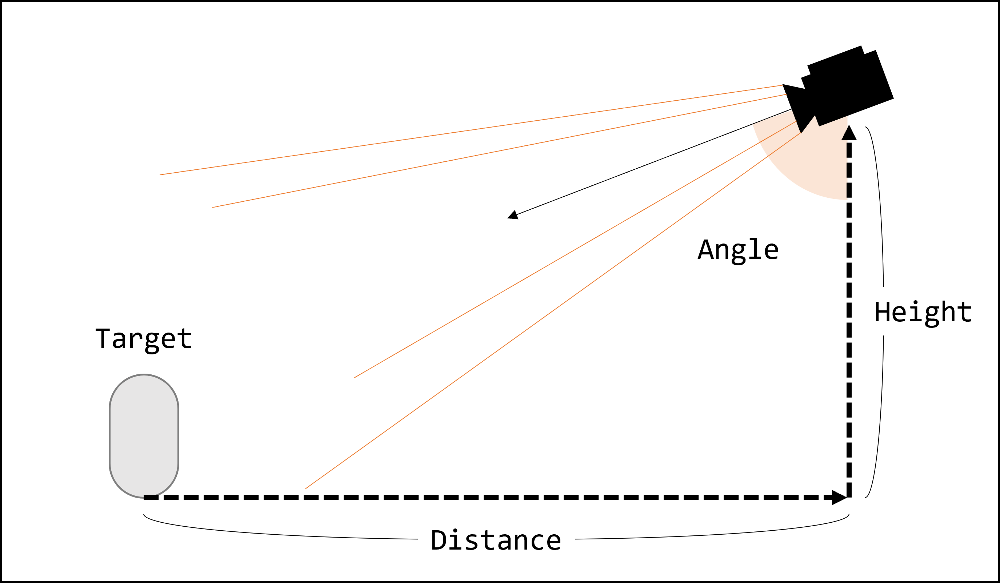

## 목적

동적으로 미니맵을 생성하고, 이를 유동적으로 관리하기 위한 목표로 설계된 패키지

## 구성

### Minimap Creator

기본적으로 제공되는 미니맵 Setter (Perspective/Orthographic) 혹은 커스터마이징된 미니맵 Setter의 Format을 ScriptableObject 형태로 생성하여, Asset 파일 형태로 떨어뜨려 놓습니다. Project View -> Create -> MinimapCreator로부터 ScriptableObject를 생성할 수 있습니다.

### Minimap Setter

Minimap을 동적으로 생성하기 위한 주조틀입니다. 패키지에는 기본적으로 Perspective, Orthographic이 존재합니다.

#### Orthographic Minimap Setter


Orthographic Camera로 구성된 Minimap Setter입니다. Inspector에 나타나는 프로퍼티는 다음과 같습니다.

| Property                | Type  | Detail                                                            |
|-------------------------|-------|-------------------------------------------------------------------|
| Default Height          | float | 기본 카메라 높이                                                   |
| Default Size            | float | Orthographic Camera의 기본 Size                                   |
| Default Near Clip Plane | int   | Orthographic Camera의 기본 Near Clip Plane                        |
| Default Far Clip Plane  | int   | Orthographic Camera의 기본 Far Clip Plane                         |
| Zoom Speed              | float | Zoom In&Out의 속도 프로퍼티                                        |
| Min Size                | int   | Orthographic Camera의 최소 Zoom 사이즈 (Default Size와 Dependency) |
| Max Size                | int   | Orthographic Camera의 최대 Zoom 사이즈 (Default Size와 Dependency) |
| Move Speed              | float | Minimap 이동 속도                                                 |

#### Perspective Minimap Setter



Perspective Camera로 구성된 Minimap Setter입니다. Inspector에 나타나는 프로퍼티는 다음과 같습니다.

| Property                | Type  | Detail                                                                        |
|-------------------------|-------|-------------------------------------------------------------------------------|
| Default Height          | float | 기본 카메라 높이                                                               |
| Default Distance        | float | Perspective Camera가 대상으로부터 떨어진 기본 거리                              |
| Default Angle           | float | Perspective Camera가 대상을 바라보는 기본 각도                                  |
| Default FOV             | float | Perspective Camera의 기본 Field Of View                                       |
| Default Near Clip Plane | int   | Perspective Camera의 기본 Near Clip Plane                                     |
| Default Far Clip Plane  | int   | Perspective Camera의 기본 Far Clip Plane                                      |
| Zoom Speed              | float | Zoom In&Out의 속도 프로퍼티                                                    |
| Min Magnification       | float | Perspective Camera의 최소 Zoom 사이즈 (Default Distance와 Height에 Dependency) |
| Max Magnification       | float | Perspective Camera의 최대 Zoom 사이즈 (Default Distance와 Height에 Dependency) |
| Move Speed              | float | Minimap 이동 속도                                                             |

#### 공통 사항

Minimap Setter가 공통적으로 갖는 프로퍼티입니다.

| World Configuration | Type    | Detail     |
|---------------------|---------|------------|
| World Center        | vector2 | 맵의 중심지 |
| World Width         | float   | 맵의 가로폭 |
| World Height        | float   | 맵의 세로폭 |

| Minimap Icons | Type       | Detail                   |
|---------------|------------|--------------------------|
| Tag           | string     | 미니맵 아이콘이 할당될 Tag |
| Icon Prefab   | GameObject | 생성될 아이콘 프리팹       |

미니맵은 Runtime에 빌드되어 사용될 때, Tag 기반으로 대상 GameObject를 실시간으로 찾습니다. 물론, Scene내 모든 GameObject를 대상으로 찾는게 아닙니다.

### MinimapIconSetterBase

해당 Component가 붙은 GameObject를 대상으로 탐색을 진행하며, 찾은 GameObject의 Tag가 MinimapSetter에 지정된 아이템과 동일하다면, 동적으로 생성하여 Minimap Texture에서 해당 아이콘이 보이도록 합니다. 이 때, MinimapIconSetterBase는 Minimap Setter를 필드로 할당되어야 합니다.

### 특징

해당 패키지의 특징은 단일의 미니맵 인스턴스를 지향하지 않습니다. 이를테면, Top-view based minimap과 Front-view based minimap을 보여줄 수 있으니 말입니다. 따라서, 동시에 여러 개의 MinimapSetter를 Asset 파일로 생성하여 Runtime 중, 각각의 RenderTexture에 동시에 렌더링이 가능토록 합니다.

### 사용법

미니맵 빌드

```csharp

MinimapSetter _minimapCamera;   // ScriptableObject 형태의 MinimapSetter
GameObject _trackingTarget;     // Minimap Camera의 Tracking target

RawImage _defaultMinimapRawImage;   // 기본 RawImage
RawImage _extendedMinimapRawImage;  // 확대 RawImage
...

private void Start ()
{
    MinimapBuilder minimapBuilder = new MinimapBuilder();

    _minimap = minimapBuilder.SetMinimapCamera(_minimapCamera)
        .SetRenderTextureInRawImage(("Basic minimap", _defaultMinimapRawImage),     // 한 미니맵은 여러 RenderTexture를 가질 수 있음
                                    ("Extended minimap", _extendedMinimapRawImage)) // Basic minimap키와 Extended minimap키의 RenderTexture들이 등록됨
        .AddOnChangeListener(("Basic minimap", (renderTexture) => ActiveDefaultMinimap(renderTexture)), // 각 키의 RenderTexture가 활성화 되었을 때, 발생될 이벤트 등록
                                ("Extended minimap", (renderTexture) => ActiveExtendedMinimap(renderTexture)))
        .SetTrackingTarget(_trackingTarget.transform)
        .Build();

    _minimap.Run("Basic minimap");  // 등록된 Basic minimap 키의 RenderTexture 활성화

    _minimapMinimizeButton.onClick.AddListener(OnClickMinimapMinimize);
    _minimapMaximizeButton.onClick.AddListener(OnClickMinimapMaximize);

    _extendedMinimapHoverManager = _extendedMinimapRawImage.gameObject.AddComponent<RawImageHoverManager>();
}

private void OnClickMinimapMaximize()
{
    if (_minimap.CurrentRenderTextureKey == "Extended minimap")
        return;
    _minimap.Run("Extended minimap");
}

private void OnClickMinimapMinimize()
{
    if (_minimap.CurrentRenderTextureKey == "Basic minimap")
        return;
    _minimap.Run("Basic minimap");
}

private void ActiveDefaultMinimap(RenderTexture renderTexture)
{
    // Do something
}

private void ActiveExtendedMinimap(RenderTexture renderTexture)
{
    // Do something
}

```

## 예제

*MinimapTestScene 참고*

- MinimapTestScene에서는 미리 Minimap Creator로 생성된 Perspective Minimap, Orthographic Minimap을 할당하여, 각기 테스트를 수행할 수 있음.

